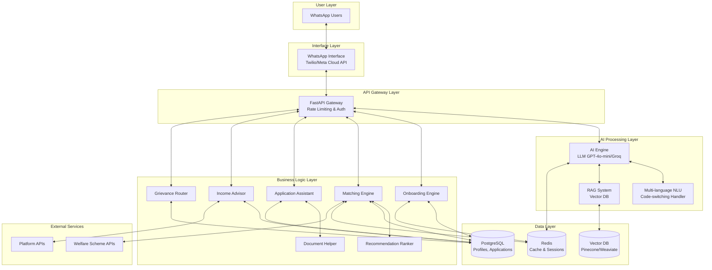

# Design Document: GigSahayak

## Overview

GigSahayak is an AI-powered WhatsApp-based assistant that provides gig workers in Hyderabad with personalized access to welfare schemes, income optimization strategies, and grievance support. The system uses conversational AI to profile workers, match them to relevant opportunities, and guide them through application processes.

The architecture follows a microservices-inspired approach with clear separation between the WhatsApp interface layer, AI processing layer, business logic layer, and data persistence layer. The system leverages LLM-based natural language understanding with RAG for accurate information retrieval, combined with rule-based and ML-based recommendation ranking.

Key design principles:
- **Conversational-first**: All interactions optimized for natural WhatsApp conversations
- **Multi-language support**: Native handling of Telugu, Hindi, English, and code-switching
- **Fast response times**: <3 second response target through caching and optimization
- **Scalability**: Horizontal scaling to support 200,000+ workers
- **Privacy-by-design**: Encryption and data protection built into every component

## Architecture

### High-Level Architecture



### Component Interaction Flow

**Onboarding Flow:**
1. User sends initial message to WhatsApp
2. WhatsApp Interface receives webhook, forwards to API Gateway
3. API Gateway routes to Onboarding Engine
4. Onboarding Engine checks Redis for existing session
5. AI Engine generates conversational question using NLU
6. Response sent back through WhatsApp Interface
7. User responses processed, profile built incrementally
8. Complete profile stored in PostgreSQL, cached in Redis

**Recommendation Flow:**
1. User requests recommendations (or triggered after onboarding)
2. Matching Engine retrieves profile from cache/database
3. Matching Engine queries welfare schemes from PostgreSQL
4. For each scheme, eligibility rules evaluated
5. Recommendation Ranker scores eligible opportunities
6. RAG System retrieves detailed scheme information
7. AI Engine generates personalized presentation
8. Top 5 recommendations sent via WhatsApp Interface

**Application Assistance Flow:**
1. User selects opportunity to apply for
2. Application Assistant retrieves application requirements
3. Document Helper generates document checklist
4. AI Engine guides user through each step conversationally
5. User uploads documents via WhatsApp
6. Document Helper validates format and completeness
7. Application Assistant pre-fills forms from profile
8. Application status tracked in PostgreSQL
9. Notifications sent for status updates

## Components and Interfaces

### 1. WhatsApp Interface Component

**Responsibilities:**
- Receive incoming messages from WhatsApp webhook
- Send outgoing messages to WhatsApp API
- Handle media uploads (documents, images)
- Manage message delivery status
- Handle WhatsApp-specific formatting (buttons, lists)

**Interfaces:**

```python
class WhatsAppInterface:
    def receive_message(webhook_data: WebhookData) -> IncomingMessage:
        """Process incoming WhatsApp webhook and extract message"""
        pass
    
    def send_text_message(phone_number: str, text: str, language: str) -> MessageStatus:
        """Send text message to user"""
        pass
    
    def send_interactive_message(phone_number: str, message: InteractiveMessage) -> MessageStatus:
        """Send message with buttons or list options"""
        pass
    
    def download_media(media_id: str) -> MediaFile:
        """Download media file from WhatsApp"""
        pass
    
    def get_delivery_status(message_id: str) -> DeliveryStatus:
        """Check if message was delivered/read"""
        pass
```

**Data Models:**

```python
@dataclass
class IncomingMessage:
    message_id: str
    phone_number: str
    text: str
    media_url: Optional[str]
    timestamp: datetime
    
@dataclass
class InteractiveMessage:
    text: str
    buttons: List[Button]  # Max 3 buttons
    # OR
    list_sections: List[ListSection]  # For longer option lists
```

### 2. AI Engine Component

**Responsibilities:**
- Process natural language input using LLM
- Generate contextual responses
- Maintain conversation coherence
- Handle multi-language and code-switching
- Integrate with RAG for knowledge retrieval

**Interfaces:**

```python
class AIEngine:
    def process_message(
        message: str,
        conversation_context: ConversationContext,
        language: str
    ) -> AIResponse:
        """Process user message and generate response"""
        pass
    
    def detect_language(message: str) -> LanguageDetection:
        """Detect primary language and code-switching"""
        pass
    
    def extract_entities(message: str, language: str) -> List[Entity]:
        """Extract structured information from message"""
        pass
    
    def generate_question(
        question_type: str,
        context: Dict,
        language: str
    ) -> str:
        """Generate conversational question for onboarding"""
        pass
```

**Data Models:**

```python
@dataclass
class ConversationContext:
    session_id: str
    user_profile: Optional[WorkerProfile]
    conversation_history: List[Message]
    current_intent: str
    current_step: str
    
@dataclass
class AIResponse:
    text: str
    detected_intent: str
    extracted_entities: List[Entity]
    confidence: float
    suggested_actions: List[str]
    
@dataclass
class LanguageDetection:
    primary_language: str  # 'te', 'hi', 'en'
    code_switched: bool
    language_spans: List[Tuple[int, int, str]]  # (start, end, lang)
```

### 3. Onboarding Engine Component

**Responsibilities:**
- Manage 10-question onboarding flow
- Track onboarding progress
- Build worker profile incrementally
- Handle incomplete or ambiguous responses
- Ensure 80%+ completion rate

**Interfaces:**

```python
class OnboardingEngine:
    def start_onboarding(phone_number: str) -> OnboardingSession:
        """Initialize new onboarding session"""
        pass
    
    def process_response(
        session_id: str,
        response: str,
        language: str
    ) -> OnboardingStep:
        """Process answer and determine next question"""
        pass
    
    def get_next_question(session: OnboardingSession, language: str) -> Question:
        """Generate next onboarding question"""
        pass
    
    def complete_onboarding(session_id: str) -> WorkerProfile:
        """Finalize profile and mark onboarding complete"""
        pass
    
    def resume_onboarding(session_id: str) -> OnboardingSession:
        """Resume interrupted onboarding"""
        pass
```

**Data Models:**

```python
@dataclass
class OnboardingSession:
    session_id: str
    phone_number: str
    started_at: datetime
    current_question_index: int
    responses: Dict[str, Any]
    completion_percentage: float
    
@dataclass
class Question:
    question_id: str
    question_text: str
    question_type: str  # 'text', 'choice', 'number', 'location'
    validation_rules: List[ValidationRule]
    follow_up_conditions: Optional[Dict]
    
@dataclass
class WorkerProfile:
    profile_id: str
    phone_number: str
    name: str
    age: int
    gender: str
    primary_platform: str  # 'swiggy', 'zomato', 'uber', etc.
    secondary_platforms: List[str]
    work_type: str  # 'delivery', 'ride', 'logistics', 'freelance'
    years_experience: float
    average_monthly_income: int
    work_zones: List[str]  # Areas in Hyderabad
    preferred_language: str
    has_bank_account: bool
    has_aadhaar: bool
    has_pan: bool
    created_at: datetime
    completed_at: datetime
```

### 4. Matching Engine Component

**Responsibilities:**
- Match worker profiles to welfare schemes
- Evaluate eligibility criteria
- Query scheme database
- Interface with Recommendation Ranker
- Re-evaluate when profile changes

**Interfaces:**

```python
class MatchingEngine:
    def find_opportunities(profile: WorkerProfile) -> List[OpportunityMatch]:
        """Find all matching opportunities for worker"""
        pass
    
    def check_eligibility(
        profile: WorkerProfile,
        scheme: WelfareScheme
    ) -> EligibilityResult:
        """Check if worker is eligible for specific scheme"""
        pass
    
    def get_ranked_recommendations(
        profile: WorkerProfile,
        limit: int = 5
    ) -> List[Recommendation]:
        """Get top N ranked recommendations"""
        pass
    
    def refresh_recommendations(profile_id: str) -> List[Recommendation]:
        """Re-evaluate recommendations after profile update"""
        pass
```

**Data Models:**

```python
@dataclass
class WelfareScheme:
    scheme_id: str
    name: str
    name_translations: Dict[str, str]  # {'te': '...', 'hi': '...'}
    description: str
    provider: str  # 'government', 'platform', 'ngo'
    benefit_type: str  # 'cash', 'insurance', 'training', 'legal'
    estimated_value: int  # In rupees
    eligibility_criteria: List[EligibilityCriterion]
    application_complexity: str  # 'low', 'medium', 'high'
    required_documents: List[str]
    application_deadline: Optional[datetime]
    application_url: Optional[str]
    
@dataclass
class EligibilityCriterion:
    field: str  # Profile field to check
    operator: str  # 'equals', 'greater_than', 'in', 'has'
    value: Any
    
@dataclass
class OpportunityMatch:
    scheme: WelfareScheme
    eligibility_score: float  # 0.0 to 1.0
    missing_requirements: List[str]
    
@dataclass
class Recommendation:
    scheme: WelfareScheme
    rank_score: float
    personalized_message: str
    estimated_benefit: int
    application_steps: List[str]
```

### 5. Recommendation Ranker Component

**Responsibilities:**
- Score opportunities based on multiple factors
- Rank opportunities by relevance
- Balance benefit value, eligibility, and complexity
- Apply ML-based scoring when available

**Interfaces:**

```python
class RecommendationRanker:
    def score_opportunity(
        profile: WorkerProfile,
        match: OpportunityMatch
    ) -> float:
        """Calculate ranking score for opportunity"""
        pass
    
    def rank_opportunities(
        profile: WorkerProfile,
        matches: List[OpportunityMatch]
    ) -> List[Recommendation]:
        """Rank all matched opportunities"""
        pass
    
    def apply_ml_scoring(
        profile: WorkerProfile,
        scheme: WelfareScheme
    ) -> float:
        """Apply ML model for scoring (if available)"""
        pass
```

**Scoring Formula:**

```
rank_score = (
    0.4 * eligibility_score +
    0.3 * normalized_benefit_value +
    0.2 * (1 - complexity_score) +
    0.1 * urgency_score
)

Where:
- eligibility_score: 0.0-1.0 based on how well profile matches criteria
- normalized_benefit_value: benefit_value / max_benefit_value
- complexity_score: 0.0 (low), 0.5 (medium), 1.0 (high)
- urgency_score: 1.0 if deadline within 30 days, else 0.5
```

### 6. Application Assistant Component

**Responsibilities:**
- Guide workers through application processes
- Provide step-by-step instructions
- Pre-fill forms with profile data
- Track application progress
- Send status updates

**Interfaces:**

```python
class ApplicationAssistant:
    def start_application(
        profile_id: str,
        scheme_id: str
    ) -> ApplicationSession:
        """Initialize application process"""
        pass
    
    def get_next_step(session_id: str) -> ApplicationStep:
        """Get next step in application process"""
        pass
    
    def complete_step(
        session_id: str,
        step_id: str,
        data: Dict
    ) -> StepResult:
        """Mark step complete and validate data"""
        pass
    
    def prefill_form(
        profile: WorkerProfile,
        form_template: FormTemplate
    ) -> PrefilledForm:
        """Pre-fill form fields from profile"""
        pass
    
    def track_application_status(application_id: str) -> ApplicationStatus:
        """Get current application status"""
        pass
```

**Data Models:**

```python
@dataclass
class ApplicationSession:
    session_id: str
    profile_id: str
    scheme_id: str
    started_at: datetime
    current_step_index: int
    total_steps: int
    completed_steps: List[str]
    
@dataclass
class ApplicationStep:
    step_id: str
    step_number: int
    title: str
    description: str
    action_type: str  # 'upload_document', 'fill_form', 'visit_url', 'wait'
    required_data: List[str]
    validation_rules: List[ValidationRule]
    
@dataclass
class ApplicationStatus:
    application_id: str
    status: str  # 'initiated', 'in_progress', 'submitted', 'approved', 'rejected'
    last_updated: datetime
    next_action: Optional[str]
```

### 7. Document Helper Component

**Responsibilities:**
- Generate document checklists
- Validate uploaded documents
- Check document format and completeness
- Provide document preparation guidance

**Interfaces:**

```python
class DocumentHelper:
    def get_document_checklist(scheme_id: str) -> DocumentChecklist:
        """Get list of required documents for scheme"""
        pass
    
    def validate_document(
        document: MediaFile,
        document_type: str
    ) -> ValidationResult:
        """Validate uploaded document"""
        pass
    
    def extract_document_info(document: MediaFile) -> DocumentInfo:
        """Extract information from document (OCR if needed)"""
        pass
    
    def provide_document_guidance(document_type: str, language: str) -> str:
        """Provide instructions for preparing document"""
        pass
```

**Data Models:**

```python
@dataclass
class DocumentChecklist:
    scheme_id: str
    required_documents: List[DocumentRequirement]
    optional_documents: List[DocumentRequirement]
    
@dataclass
class DocumentRequirement:
    document_type: str  # 'aadhaar', 'pan', 'bank_statement', etc.
    description: str
    format_requirements: List[str]  # ['PDF', 'JPG', 'PNG']
    max_size_mb: int
    
@dataclass
class ValidationResult:
    is_valid: bool
    issues: List[str]
    suggestions: List[str]
```

### 8. Income Advisor Component

**Responsibilities:**
- Provide income optimization strategies
- Recommend peak hours and zones
- Suggest multi-platform strategies
- Incorporate seasonal trends

**Interfaces:**

```python
class IncomeAdvisor:
    def get_income_strategies(profile: WorkerProfile) -> List[IncomeStrategy]:
        """Get personalized income optimization strategies"""
        pass
    
    def get_peak_hours(
        work_type: str,
        platform: str,
        day_of_week: str
    ) -> List[TimeSlot]:
        """Get peak earning hours"""
        pass
    
    def get_high_demand_zones(
        work_type: str,
        time_of_day: str
    ) -> List[Zone]:
        """Get high-demand geographic zones"""
        pass
    
    def get_platform_switching_advice(
        profile: WorkerProfile,
        current_time: datetime
    ) -> PlatformAdvice:
        """Suggest which platform to work on"""
        pass
```

**Data Models:**

```python
@dataclass
class IncomeStrategy:
    strategy_id: str
    title: str
    description: str
    estimated_income_increase: int  # Rupees per month
    effort_level: str  # 'low', 'medium', 'high'
    applicable_platforms: List[str]
    
@dataclass
class TimeSlot:
    start_time: time
    end_time: time
    demand_level: str  # 'high', 'medium', 'low'
    estimated_earnings_per_hour: int
    
@dataclass
class Zone:
    zone_name: str
    coordinates: Tuple[float, float]  # (lat, lon)
    demand_level: str
    popular_for: List[str]  # ['lunch', 'dinner', 'late_night']
```

### 9. Grievance Router Component

**Responsibilities:**
- Categorize worker grievances
- Provide resolution guidance
- Route to appropriate support
- Track grievance patterns

**Interfaces:**

```python
class GrievanceRouter:
    def categorize_grievance(message: str, language: str) -> GrievanceCategory:
        """Categorize the type of grievance"""
        pass
    
    def get_resolution_steps(category: GrievanceCategory) -> List[ResolutionStep]:
        """Get steps to resolve grievance"""
        pass
    
    def route_to_support(
        grievance: Grievance,
        profile: WorkerProfile
    ) -> SupportRoute:
        """Determine appropriate support channel"""
        pass
    
    def track_grievance(grievance_id: str) -> GrievanceStatus:
        """Track grievance resolution status"""
        pass
    
    def detect_patterns(time_window: timedelta) -> List[GrievancePattern]:
        """Identify common grievance patterns"""
        pass
```

**Data Models:**

```python
@dataclass
class GrievanceCategory:
    category: str  # 'account_block', 'payment_dispute', 'safety', 'other'
    subcategory: Optional[str]
    severity: str  # 'low', 'medium', 'high', 'critical'
    platform: Optional[str]
    
@dataclass
class Grievance:
    grievance_id: str
    profile_id: str
    category: GrievanceCategory
    description: str
    reported_at: datetime
    status: str
    
@dataclass
class SupportRoute:
    route_type: str  # 'self_service', 'platform_support', 'legal_aid', 'ngo'
    contact_info: Dict[str, str]
    estimated_resolution_time: str
    instructions: List[str]
```

### 10. RAG System Component

**Responsibilities:**
- Store welfare scheme documents in vector database
- Retrieve relevant information for queries
- Ground AI responses in factual documents
- Update knowledge base

**Interfaces:**

```python
class RAGSystem:
    def index_document(document: Document) -> str:
        """Add document to vector database"""
        pass
    
    def retrieve_relevant_docs(
        query: str,
        top_k: int = 5
    ) -> List[RetrievedDocument]:
        """Retrieve most relevant documents"""
        pass
    
    def update_document(document_id: str, updated_content: str) -> bool:
        """Update existing document"""
        pass
    
    def delete_document(document_id: str) -> bool:
        """Remove document from index"""
        pass
```

**Data Models:**

```python
@dataclass
class Document:
    document_id: str
    title: str
    content: str
    metadata: Dict[str, Any]
    document_type: str  # 'scheme', 'policy', 'faq', 'guide'
    language: str
    
@dataclass
class RetrievedDocument:
    document_id: str
    content: str
    relevance_score: float
    metadata: Dict[str, Any]
```

## Data Models

### Core Database Schema (PostgreSQL)

```sql
-- Worker Profiles
CREATE TABLE worker_profiles (
    profile_id UUID PRIMARY KEY,
    phone_number VARCHAR(15) UNIQUE NOT NULL,
    name VARCHAR(100) NOT NULL,
    age INTEGER,
    gender VARCHAR(20),
    primary_platform VARCHAR(50),
    secondary_platforms TEXT[],
    work_type VARCHAR(50),
    years_experience DECIMAL(3,1),
    average_monthly_income INTEGER,
    work_zones TEXT[],
    preferred_language VARCHAR(5),
    has_bank_account BOOLEAN,
    has_aadhaar BOOLEAN,
    has_pan BOOLEAN,
    created_at TIMESTAMP DEFAULT NOW(),
    completed_at TIMESTAMP,
    last_active_at TIMESTAMP,
    profile_data JSONB  -- Flexible storage for additional fields
);

-- Welfare Schemes
CREATE TABLE welfare_schemes (
    scheme_id UUID PRIMARY KEY,
    name VARCHAR(200) NOT NULL,
    name_translations JSONB,
    description TEXT,
    provider VARCHAR(100),
    benefit_type VARCHAR(50),
    estimated_value INTEGER,
    eligibility_criteria JSONB,
    application_complexity VARCHAR(20),
    required_documents TEXT[],
    application_deadline TIMESTAMP,
    application_url TEXT,
    is_active BOOLEAN DEFAULT TRUE,
    created_at TIMESTAMP DEFAULT NOW(),
    updated_at TIMESTAMP DEFAULT NOW()
);

-- Applications
CREATE TABLE applications (
    application_id UUID PRIMARY KEY,
    profile_id UUID REFERENCES worker_profiles(profile_id),
    scheme_id UUID REFERENCES welfare_schemes(scheme_id),
    status VARCHAR(50),
    started_at TIMESTAMP DEFAULT NOW(),
    submitted_at TIMESTAMP,
    last_updated_at TIMESTAMP DEFAULT NOW(),
    current_step_index INTEGER,
    completed_steps TEXT[],
    application_data JSONB,
    UNIQUE(profile_id, scheme_id)
);

-- Recommendations
CREATE TABLE recommendations (
    recommendation_id UUID PRIMARY KEY,
    profile_id UUID REFERENCES worker_profiles(profile_id),
    scheme_id UUID REFERENCES welfare_schemes(scheme_id),
    rank_score DECIMAL(3,2),
    generated_at TIMESTAMP DEFAULT NOW(),
    viewed_at TIMESTAMP,
    clicked_at TIMESTAMP,
    applied_at TIMESTAMP
);

-- Grievances
CREATE TABLE grievances (
    grievance_id UUID PRIMARY KEY,
    profile_id UUID REFERENCES worker_profiles(profile_id),
    category VARCHAR(50),
    subcategory VARCHAR(50),
    severity VARCHAR(20),
    platform VARCHAR(50),
    description TEXT,
    reported_at TIMESTAMP DEFAULT NOW(),
    status VARCHAR(50),
    resolved_at TIMESTAMP,
    resolution_notes TEXT
);

-- Conversations
CREATE TABLE conversations (
    conversation_id UUID PRIMARY KEY,
    phone_number VARCHAR(15) NOT NULL,
    profile_id UUID REFERENCES worker_profiles(profile_id),
    started_at TIMESTAMP DEFAULT NOW(),
    last_message_at TIMESTAMP DEFAULT NOW(),
    message_count INTEGER DEFAULT 0,
    current_intent VARCHAR(50),
    conversation_data JSONB
);

-- Messages
CREATE TABLE messages (
    message_id UUID PRIMARY KEY,
    conversation_id UUID REFERENCES conversations(conversation_id),
    direction VARCHAR(10),  -- 'inbound' or 'outbound'
    message_text TEXT,
    language VARCHAR(5),
    timestamp TIMESTAMP DEFAULT NOW(),
    whatsapp_message_id VARCHAR(100),
    delivery_status VARCHAR(20)
);

-- Feedback
CREATE TABLE feedback (
    feedback_id UUID PRIMARY KEY,
    profile_id UUID REFERENCES worker_profiles(profile_id),
    rating INTEGER CHECK (rating >= 1 AND rating <= 5),
    feedback_text TEXT,
    feedback_type VARCHAR(50),  -- 'application', 'recommendation', 'overall'
    related_id UUID,  -- application_id or scheme_id
    submitted_at TIMESTAMP DEFAULT NOW()
);

-- Analytics Events
CREATE TABLE analytics_events (
    event_id UUID PRIMARY KEY,
    profile_id UUID REFERENCES worker_profiles(profile_id),
    event_type VARCHAR(50),
    event_data JSONB,
    timestamp TIMESTAMP DEFAULT NOW()
);

-- Indexes for performance
CREATE INDEX idx_profiles_phone ON worker_profiles(phone_number);
CREATE INDEX idx_profiles_platform ON worker_profiles(primary_platform);
CREATE INDEX idx_applications_profile ON applications(profile_id);
CREATE INDEX idx_applications_status ON applications(status);
CREATE INDEX idx_recommendations_profile ON recommendations(profile_id);
CREATE INDEX idx_grievances_profile ON grievances(profile_id);
CREATE INDEX idx_grievances_status ON grievances(status);
CREATE INDEX idx_conversations_phone ON conversations(phone_number);
CREATE INDEX idx_messages_conversation ON messages(conversation_id);
CREATE INDEX idx_analytics_profile ON analytics_events(profile_id);
CREATE INDEX idx_analytics_type ON analytics_events(event_type);
```

### Redis Cache Structure

```python
# Session management
session:{session_id} = {
    "phone_number": str,
    "profile_id": str,
    "current_intent": str,
    "conversation_context": dict,
    "expires_at": timestamp
}
# TTL: 24 hours

# Profile cache
profile:{profile_id} = WorkerProfile (serialized)
# TTL: 1 hour

# Recommendation cache
recommendations:{profile_id} = List[Recommendation] (serialized)
# TTL: 6 hours

# Rate limiting
rate_limit:{phone_number}:{minute} = request_count
# TTL: 1 minute

# Onboarding state
onboarding:{session_id} = OnboardingSession (serialized)
# TTL: 24 hours
```


## Correctness Properties

A property is a characteristic or behavior that should hold true across all valid executions of a system—essentially, a formal statement about what the system should do. Properties serve as the bridge between human-readable specifications and machine-verifiable correctness guarantees.

### Property Reflection

After analyzing all acceptance criteria, I identified several areas where properties can be consolidated to avoid redundancy:

1. **Language Processing (2.1-2.4)**: Instead of separate properties for Telugu, Hindi, English, and code-switching, we can have a single comprehensive property that covers all language inputs.

2. **Data Persistence (1.7, 4.6, 6.5, 9.5, 10.1, 10.2, 13.3)**: Multiple properties about storing data can be consolidated into properties about persistence guarantees and audit logging.

3. **Notification Triggers (12.1, 12.3, 12.4)**: These can be consolidated into a property about notification scheduling based on events.

4. **Error Handling (14.1-14.6)**: These can be consolidated into properties about graceful degradation and recovery.

5. **Validation (4.3, 15.4)**: Document validation and content validation can be combined into a general validation property.

The following properties represent the unique, non-redundant correctness guarantees for GigSahayak:

### Core Onboarding Properties

**Property 1: Fixed Question Count**
*For any* onboarding session, the total number of primary questions asked (excluding clarifying follow-ups) should equal exactly 10.
**Validates: Requirements 1.2**

**Property 2: Multi-language Processing**
*For any* message in Telugu, Hindi, English, or code-switched combinations, the AI Engine should correctly extract the intent and entities with confidence above the threshold.
**Validates: Requirements 1.3, 2.1, 2.2, 2.3, 2.4**

**Property 3: Profile Completion Persistence**
*For any* onboarding session where all 10 questions are answered, the resulting profile should be marked as complete and retrievable from the database.
**Validates: Requirements 1.4, 1.7**

**Property 4: Clarifying Questions Don't Count**
*For any* onboarding session where ambiguous responses trigger follow-up questions, the follow-up questions should not increment the primary question counter.
**Validates: Requirements 1.6**

**Property 5: Language Response Consistency**
*For any* worker message in a specific language, the system's response should be in the same language as detected in the worker's most recent message.
**Validates: Requirements 2.5**

### Matching and Recommendation Properties

**Property 6: Complete Opportunity Identification**
*For any* worker profile, the Matching Engine should identify all welfare schemes where the profile satisfies the eligibility criteria.
**Validates: Requirements 3.1**

**Property 7: Recommendation Ranking Order**
*For any* set of matched opportunities, the Recommendation Ranker should order them by descending rank score, where rank score is computed from eligibility, benefit value, complexity, and urgency.
**Validates: Requirements 3.2**

**Property 8: Top-N Recommendation Limit**
*For any* recommendation request, the system should return at most 5 opportunities (or fewer if less than 5 match).
**Validates: Requirements 3.3**

**Property 9: Pagination Preserves Ranking**
*For any* recommendation list, if a worker requests more recommendations beyond the initial 5, the additional recommendations should continue in the same rank order from the complete ranked list.
**Validates: Requirements 3.4**

**Property 10: Recommendation Completeness**
*For any* recommendation presented to a worker, it should include the opportunity name, estimated benefit value, and eligibility summary.
**Validates: Requirements 3.5**

**Property 11: Profile Change Triggers Re-evaluation**
*For any* worker profile that is updated, the system should regenerate recommendations to reflect the new profile state.
**Validates: Requirements 3.8**

### Application Assistant Properties

**Property 12: Application Guide Provision**
*For any* opportunity selected by a worker, the Application Assistant should provide a non-empty step-by-step application guide.
**Validates: Requirements 4.1**

**Property 13: Document Checklist Completeness**
*For any* application that requires documents, the Document Helper should provide a checklist containing all required documents specified in the scheme definition.
**Validates: Requirements 4.2**

**Property 14: Document Validation**
*For any* uploaded document, the system should validate the format against allowed formats and provide feedback indicating validity status and any issues.
**Validates: Requirements 4.3**

**Property 15: Form Pre-filling from Profile**
*For any* application form field that matches a field in the worker's profile, the Application Assistant should pre-fill that field with the profile value.
**Validates: Requirements 4.4**

**Property 16: Step Progression**
*For any* application step marked as complete, the Application Assistant should present the next step in sequence (or completion confirmation if it was the final step).
**Validates: Requirements 4.5**

**Property 17: Application Tracking Initialization**
*For any* submitted application, the Backend System should create a tracking record with initial status and timestamp.
**Validates: Requirements 4.6**

### Income Optimization Properties

**Property 18: Strategy Generation for Profile**
*For any* worker profile requesting income advice, the Income Advisor should generate at least one income optimization strategy relevant to the worker's platforms and work type.
**Validates: Requirements 5.1**

**Property 19: Peak Hours Based on Demand Data**
*For any* peak hour recommendation, the suggested time slots should correspond to periods with higher-than-average demand in the historical data for that work type and platform.
**Validates: Requirements 5.2**

**Property 20: Zone Recommendations in Hyderabad**
*For any* zone recommendation, all suggested zones should be geographic locations within Hyderabad boundaries.
**Validates: Requirements 5.3**

**Property 21: Multi-platform Strategy for Multi-platform Workers**
*For any* worker profile with multiple platforms listed, the Income Advisor should provide platform-switching strategies that reference at least two of the worker's platforms.
**Validates: Requirements 5.4**

**Property 22: Income Tips Include Estimates**
*For any* income optimization tip provided, it should include an estimated earning potential value (in rupees).
**Validates: Requirements 5.5**

**Property 23: Seasonal Trend Incorporation**
*For any* income recommendation generated during a period with known seasonal patterns, the recommendation should reflect the seasonal demand trends for that time period.
**Validates: Requirements 5.6**

### Grievance Handling Properties

**Property 24: Grievance Categorization**
*For any* reported grievance, the Grievance Router should assign it to one of the defined categories: account block, payment dispute, safety issue, or other.
**Validates: Requirements 6.1**

**Property 25: Resolution Guidance Provision**
*For any* categorized grievance, the Grievance Router should provide at least one resolution step or guidance item.
**Validates: Requirements 6.2**

**Property 26: Escalation Routing**
*For any* grievance marked as requiring escalation (based on severity or category), the Grievance Router should provide support resource contact information or legal aid references.
**Validates: Requirements 6.3**

**Property 27: Platform-Specific Information**
*For any* grievance associated with a specific platform, the Grievance Router should provide contact information specific to that platform.
**Validates: Requirements 6.4**

**Property 28: Grievance Resolution Tracking**
*For any* grievance marked as resolved, the Backend System should record the resolution timestamp and outcome in the database.
**Validates: Requirements 6.5**

**Property 29: Pattern Detection and Alerting**
*For any* cluster of similar grievances (3+ grievances with the same category and subcategory within a time window), the system should identify the pattern and generate alerts for other workers.
**Validates: Requirements 6.6**

### RAG and Knowledge Properties

**Property 30: Document Retrieval for Queries**
*For any* query about welfare schemes, the RAG System should retrieve at least one relevant document from the vector database (or return empty if no documents match).
**Validates: Requirements 7.1**

**Property 31: Response Grounding in Documents**
*For any* AI-generated response about welfare schemes, the response content should reference information present in the retrieved documents.
**Validates: Requirements 7.3**

### Data Security and Privacy Properties

**Property 32: PII Encryption at Rest**
*For any* personally identifiable information stored in the database, the data should be encrypted using the configured encryption algorithm.
**Validates: Requirements 9.1**

**Property 33: Data Deletion Completeness**
*For any* worker who requests data deletion, all personal data associated with that worker's profile should be removed from the database after processing the deletion request.
**Validates: Requirements 9.3**

**Property 34: Audit Logging for Data Access**
*For any* access to personal data, the Backend System should create an audit log entry with timestamp, accessor identity, and data accessed.
**Validates: Requirements 9.5**

### Analytics and Monitoring Properties

**Property 35: Interaction Tracking**
*For any* user interaction (onboarding completion, application initiation, recommendation view), the Backend System should create a corresponding analytics event record.
**Validates: Requirements 10.1**

**Property 36: Recommendation Logging**
*For any* recommendation generated and presented to a worker, the Backend System should log the recommendation with scheme ID, rank score, and timestamp.
**Validates: Requirements 10.2**

**Property 37: Anomaly Alerting**
*For any* detected anomaly (error rate spike, unusual pattern), the Backend System should trigger an administrator alert with anomaly details.
**Validates: Requirements 10.6**

### Conversation State Properties

**Property 38: State Persistence Across Messages**
*For any* sequence of messages within a conversation, the conversation state should be maintained and accessible for each subsequent message.
**Validates: Requirements 11.1**

**Property 39: State Preservation After Interruption**
*For any* conversation interrupted and resumed within 24 hours, the conversation state should be restored to the point of interruption.
**Validates: Requirements 11.2, 11.3**

**Property 40: Context Access in Responses**
*For any* AI response that references previous conversation context, the response should accurately reflect information from earlier messages in the conversation history.
**Validates: Requirements 11.4**

**Property 41: Topic Change Detection**
*For any* message that introduces a new topic different from the current conversation intent, the AI Engine should update the conversation state to reflect the new topic.
**Validates: Requirements 11.5**

### Notification Properties

**Property 42: Deadline Reminder Scheduling**
*For any* application with a deadline, the system should schedule a reminder notification for 3 days before the deadline date.
**Validates: Requirements 12.1**

**Property 43: Status Change Notifications**
*For any* application status change, the system should trigger a notification to the worker with the new status.
**Validates: Requirements 12.3**

**Property 44: Re-engagement Trigger**
*For any* worker with no engagement for 7 consecutive days, the system should trigger a re-engagement message with new opportunities.
**Validates: Requirements 12.4**

**Property 45: Notification Frequency Compliance**
*For any* worker with notification frequency preferences set, the system should not send notifications more frequently than the specified preference.
**Validates: Requirements 12.5**

### Feedback Collection Properties

**Property 46: Rating Request After Completion**
*For any* completed application process, the system should send a rating request to the worker on a 5-point scale.
**Validates: Requirements 13.1**

**Property 47: Low Rating Follow-up**
*For any* rating below 3, the system should ask a follow-up question requesting specific feedback on improvement areas.
**Validates: Requirements 13.2**

**Property 48: Feedback Storage**
*For any* feedback provided by a worker (rating and/or comments), the Backend System should store the feedback with associated metadata in the database.
**Validates: Requirements 13.3**

**Property 49: Feedback Request Rate Limiting**
*For any* worker, the system should not request feedback more than once per 7-day period, regardless of the number of interactions.
**Validates: Requirements 13.4**

**Property 50: Rating Calculation Correctness**
*For any* set of ratings, the calculated average satisfaction score should equal the sum of ratings divided by the count of ratings.
**Validates: Requirements 13.5**

### Error Handling and Resilience Properties

**Property 51: AI Failure Fallback**
*For any* message where the AI Engine fails to process, the system should return a predefined fallback response and log the error with message details.
**Validates: Requirements 14.1**

**Property 52: RAG Unavailability Graceful Degradation**
*For any* query when the RAG System is unavailable, the AI Engine should provide a response using cached knowledge or acknowledge the limitation.
**Validates: Requirements 14.2**

**Property 53: Matching Failure Alternative**
*For any* recommendation request where the Matching Engine fails, the system should offer manual opportunity browsing as an alternative.
**Validates: Requirements 14.3**

**Property 54: API Timeout Retry with Backoff**
*For any* external API call that times out, the Backend System should retry up to 3 times with exponentially increasing delays between attempts.
**Validates: Requirements 14.4**

**Property 55: Critical Error Notification**
*For any* critical error detected, the system should send an immediate notification to administrators and provide users with an estimated resolution time.
**Validates: Requirements 14.5**

**Property 56: Automatic Recovery**
*For any* error condition that is resolved, the system should automatically resume normal operation without requiring user action.
**Validates: Requirements 14.6**

### Administrative Properties

**Property 57: Scheme Update Propagation**
*For any* welfare scheme update in the admin interface, the RAG System's vector database should be updated to reflect the new scheme information.
**Validates: Requirements 15.2**

**Property 58: Content Validation Before Publishing**
*For any* content update submitted through the admin interface, the system should validate the content against schema rules before allowing publication.
**Validates: Requirements 15.4**

**Property 59: Admin Action Authentication and Logging**
*For any* administrative action, the system should require authentication and create an audit log entry with admin identity, action type, and timestamp.
**Validates: Requirements 15.5**

## Error Handling

### Error Categories and Handling Strategies

**1. User Input Errors**
- **Invalid format**: Provide clear feedback and examples
- **Ambiguous responses**: Ask clarifying questions
- **Missing required information**: Prompt for specific missing data
- **Language detection failure**: Default to English, ask for preference

**2. System Errors**
- **AI Engine failures**: Use fallback responses, log errors
- **RAG System unavailable**: Use cached knowledge, degrade gracefully
- **Database connection issues**: Retry with exponential backoff, use Redis cache
- **External API failures**: Retry up to 3 times, provide alternative options

**3. Data Errors**
- **Invalid document format**: Provide validation feedback with specific issues
- **Missing profile data**: Request missing information before proceeding
- **Corrupted data**: Log error, notify admins, use backup if available

**4. Business Logic Errors**
- **No matching opportunities**: Explain eligibility gaps, suggest profile improvements
- **Application deadline passed**: Inform user, suggest similar opportunities
- **Duplicate application**: Inform user of existing application status

### Error Response Format

All error responses should follow this structure:

```python
@dataclass
class ErrorResponse:
    error_code: str
    user_message: str  # Localized, user-friendly message
    technical_details: str  # For logging
    suggested_action: Optional[str]
    retry_possible: bool
    escalation_required: bool
```

### Retry Logic

```python
def retry_with_exponential_backoff(
    func: Callable,
    max_attempts: int = 3,
    base_delay: float = 1.0,
    max_delay: float = 10.0
) -> Any:
    """
    Retry function with exponential backoff.
    Delay = min(base_delay * (2 ** attempt), max_delay)
    """
    for attempt in range(max_attempts):
        try:
            return func()
        except RetryableError as e:
            if attempt == max_attempts - 1:
                raise
            delay = min(base_delay * (2 ** attempt), max_delay)
            time.sleep(delay)
```

### Circuit Breaker Pattern

For external services, implement circuit breaker to prevent cascading failures:

```python
class CircuitBreaker:
    def __init__(
        self,
        failure_threshold: int = 5,
        recovery_timeout: int = 60,
        expected_exception: Type[Exception] = Exception
    ):
        self.failure_threshold = failure_threshold
        self.recovery_timeout = recovery_timeout
        self.expected_exception = expected_exception
        self.failure_count = 0
        self.last_failure_time = None
        self.state = "CLOSED"  # CLOSED, OPEN, HALF_OPEN
    
    def call(self, func: Callable) -> Any:
        if self.state == "OPEN":
            if time.time() - self.last_failure_time > self.recovery_timeout:
                self.state = "HALF_OPEN"
            else:
                raise CircuitBreakerOpenError()
        
        try:
            result = func()
            if self.state == "HALF_OPEN":
                self.state = "CLOSED"
                self.failure_count = 0
            return result
        except self.expected_exception as e:
            self.failure_count += 1
            self.last_failure_time = time.time()
            if self.failure_count >= self.failure_threshold:
                self.state = "OPEN"
            raise
```

## Testing Strategy

### Dual Testing Approach

GigSahayak requires both unit testing and property-based testing for comprehensive coverage:

**Unit Tests** focus on:
- Specific examples demonstrating correct behavior
- Edge cases (empty inputs, boundary values, special characters)
- Error conditions and exception handling
- Integration points between components
- Mock external dependencies (WhatsApp API, LLM, vector DB)

**Property-Based Tests** focus on:
- Universal properties that hold for all inputs
- Comprehensive input coverage through randomization
- Invariants that must be maintained
- Round-trip properties (serialization, state transitions)
- Metamorphic properties (relationships between operations)

### Property-Based Testing Configuration

**Framework Selection by Language:**
- Python: Hypothesis
- TypeScript/JavaScript: fast-check
- Java: jqwik
- Go: gopter

**Test Configuration:**
- Minimum 100 iterations per property test (due to randomization)
- Each property test must reference its design document property
- Tag format: `# Feature: gigsahayak, Property {number}: {property_text}`

**Example Property Test Structure (Python with Hypothesis):**

```python
from hypothesis import given, strategies as st
import pytest

# Feature: gigsahayak, Property 1: Fixed Question Count
@given(st.text(min_size=1, max_size=100))
def test_onboarding_always_asks_10_questions(user_response):
    """
    For any onboarding session, the total number of primary questions 
    asked (excluding clarifying follow-ups) should equal exactly 10.
    """
    session = OnboardingEngine.start_onboarding("+919876543210")
    question_count = 0
    
    while not session.is_complete():
        question = OnboardingEngine.get_next_question(session, "en")
        if question.is_primary_question:
            question_count += 1
        
        # Simulate user response
        OnboardingEngine.process_response(
            session.session_id,
            user_response,
            "en"
        )
    
    assert question_count == 10, \
        f"Expected 10 questions, got {question_count}"
```

### Test Data Generation Strategies

**For Worker Profiles:**
```python
worker_profile_strategy = st.builds(
    WorkerProfile,
    profile_id=st.uuids(),
    phone_number=st.from_regex(r'\+91[6-9]\d{9}'),
    name=st.text(min_size=2, max_size=50),
    age=st.integers(min_value=18, max_value=65),
    gender=st.sampled_from(['male', 'female', 'other']),
    primary_platform=st.sampled_from([
        'swiggy', 'zomato', 'uber', 'ola', 
        'amazon', 'flipkart', 'urban_company'
    ]),
    work_type=st.sampled_from([
        'delivery', 'ride', 'logistics', 'freelance'
    ]),
    years_experience=st.floats(min_value=0.1, max_value=20.0),
    average_monthly_income=st.integers(min_value=5000, max_value=50000),
    preferred_language=st.sampled_from(['te', 'hi', 'en'])
)
```

**For Multi-language Messages:**
```python
telugu_text_strategy = st.text(
    alphabet=st.characters(
        whitelist_categories=('Lu', 'Ll'),
        whitelist_characters='అఆఇఈఉఊఋఎఏఐఒఓఔకఖగఘఙచఛజఝఞటఠడఢణతథదధనపఫబభమయరలవశషసహళక్షజ్ఞ'
    ),
    min_size=5,
    max_size=100
)

code_switched_strategy = st.tuples(
    st.text(min_size=3, max_size=20),  # English
    telugu_text_strategy,
    st.text(min_size=3, max_size=20)   # English
).map(lambda parts: f"{parts[0]} {parts[1]} {parts[2]}")
```

### Integration Testing

**Key Integration Test Scenarios:**
1. End-to-end onboarding flow (WhatsApp → API → AI → Database)
2. Recommendation generation pipeline (Profile → Matching → Ranking → RAG → Response)
3. Application submission flow (Selection → Document Upload → Form Fill → Submission)
4. Grievance handling flow (Report → Categorization → Routing → Resolution)

**Mock External Services:**
- WhatsApp API: Mock webhook responses and message sending
- LLM API: Mock with predefined responses for known inputs
- Vector Database: Use in-memory vector store for tests
- External welfare scheme APIs: Mock with test data

### Performance Testing

**Load Testing Scenarios:**
- 100 concurrent users onboarding
- 1000 concurrent recommendation requests
- Sustained load of 50 messages/second
- Spike test: 0 to 500 users in 1 minute

**Performance Targets:**
- 95th percentile response time < 3 seconds
- Database query time < 100ms
- RAG retrieval time < 1 second
- Cache hit rate > 80% for profiles and recommendations

### Security Testing

**Test Cases:**
- SQL injection attempts in user inputs
- XSS attempts in message content
- Authentication bypass attempts
- Rate limiting enforcement
- PII encryption verification
- Audit log completeness

### Monitoring and Observability

**Key Metrics to Track:**
- Response time distribution (p50, p95, p99)
- Error rate by component
- Cache hit/miss rates
- Database connection pool utilization
- External API latency and error rates
- User engagement metrics (completion rates, application initiations)

**Alerting Thresholds:**
- Error rate > 5% for 5 minutes
- Response time p95 > 5 seconds for 5 minutes
- Database connection pool > 80% for 10 minutes
- Cache hit rate < 60% for 15 minutes
- Critical errors (any occurrence)

## Deployment Considerations

### Infrastructure Requirements

**Compute:**
- API servers: 4 vCPU, 8GB RAM (auto-scaling 2-10 instances)
- Background workers: 2 vCPU, 4GB RAM (2-5 instances)
- Redis: 2 vCPU, 4GB RAM, 10GB storage
- PostgreSQL: 4 vCPU, 16GB RAM, 100GB SSD storage

**External Services:**
- WhatsApp Business API (Twilio or Meta Cloud API)
- LLM API (OpenAI GPT-4o-mini or Groq)
- Vector Database (Pinecone or Weaviate cloud)

### Scaling Strategy

**Horizontal Scaling:**
- API servers scale based on CPU utilization (target: 70%)
- Background workers scale based on queue depth
- Database read replicas for read-heavy operations

**Caching Strategy:**
- Redis for session state (TTL: 24 hours)
- Redis for profile cache (TTL: 1 hour)
- Redis for recommendation cache (TTL: 6 hours)
- CDN for static assets

### Database Optimization

**Indexing Strategy:**
- B-tree indexes on foreign keys and frequently queried fields
- GIN indexes on JSONB columns for eligibility criteria
- Partial indexes on active schemes and recent applications

**Query Optimization:**
- Use connection pooling (min: 5, max: 20 connections)
- Implement query result caching for frequently accessed data
- Use database views for complex analytics queries
- Partition large tables (messages, analytics_events) by date

### Security Hardening

**Network Security:**
- API gateway with rate limiting (100 requests/minute per user)
- DDoS protection via cloud provider
- TLS 1.3 for all external communications
- VPC isolation for database and internal services

**Application Security:**
- Input validation and sanitization for all user inputs
- Parameterized queries to prevent SQL injection
- JWT tokens for API authentication (expiry: 1 hour)
- Secrets management via cloud provider secret store

**Data Security:**
- AES-256 encryption for PII at rest
- Field-level encryption for sensitive data
- Regular automated backups (daily full, hourly incremental)
- Backup retention: 30 days

### Disaster Recovery

**Backup Strategy:**
- Database: Daily full backup, hourly incremental
- Redis: Daily snapshot
- Vector database: Weekly full backup
- Backup storage: Geo-redundant cloud storage

**Recovery Procedures:**
- RTO (Recovery Time Objective): 4 hours
- RPO (Recovery Point Objective): 1 hour
- Automated failover for database and Redis
- Documented runbooks for manual recovery procedures

### Monitoring and Logging

**Logging Strategy:**
- Structured JSON logs for all components
- Log levels: DEBUG (dev), INFO (staging), WARN/ERROR (production)
- Centralized log aggregation (ELK stack or cloud equivalent)
- Log retention: 90 days

**Monitoring Stack:**
- Application metrics: Prometheus + Grafana
- Infrastructure metrics: Cloud provider monitoring
- Distributed tracing: Jaeger or cloud equivalent
- Uptime monitoring: External service (Pingdom, UptimeRobot)

**Dashboards:**
- System health dashboard (response times, error rates, resource utilization)
- Business metrics dashboard (onboarding completions, applications, user satisfaction)
- Cost monitoring dashboard (API usage, compute costs, storage costs)
